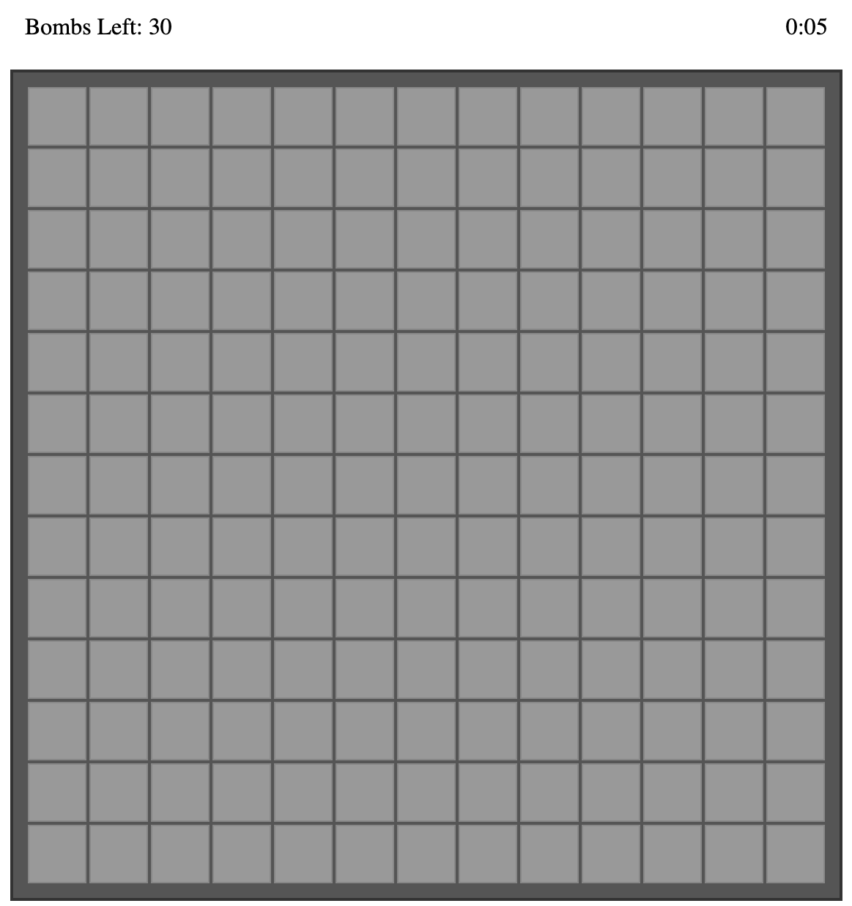
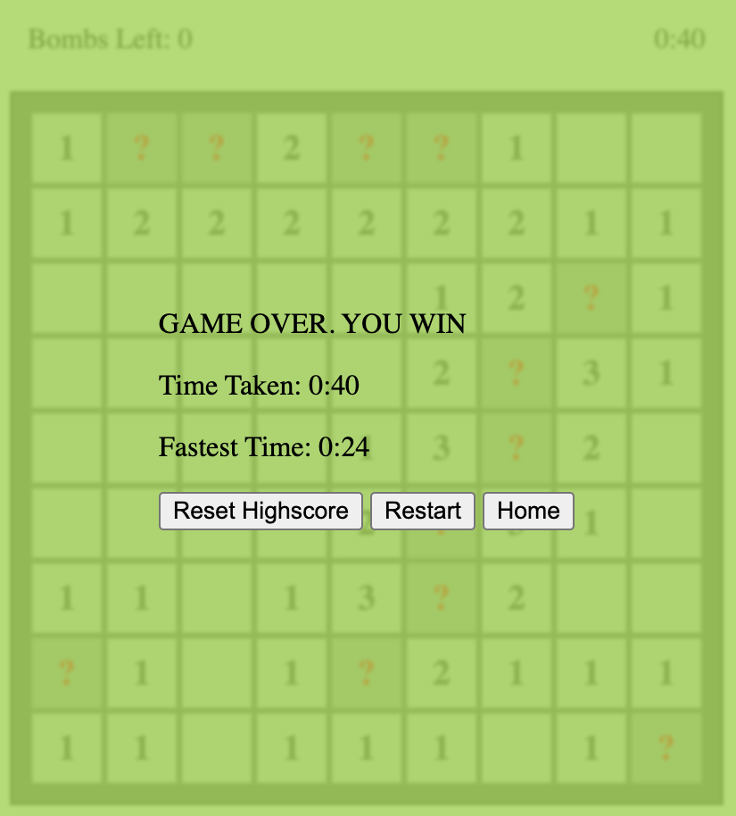
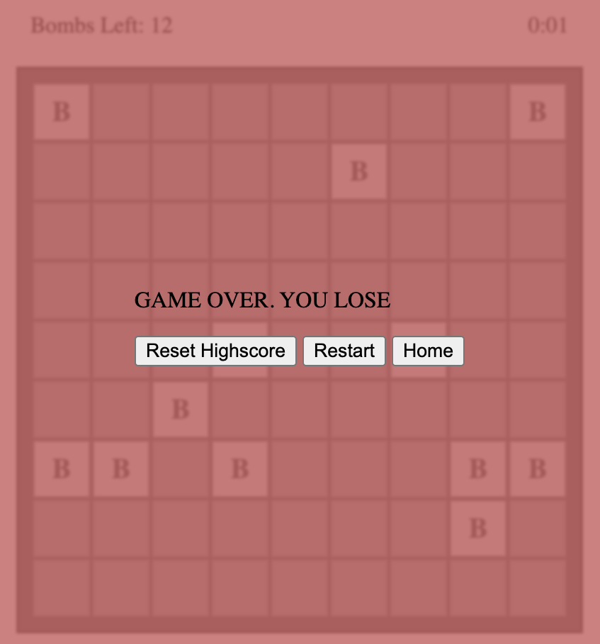

# Minesweeper Game

A classic Minesweeper game implemented in JavaScript, HTML, and CSS.

## Table of Contents

- [Introduction](#introduction)
- [Features](#features)
- [Installation](#installation)
- [Usage](#usage)
- [Gameplay](#gameplay)
- [Deployment](#deployment)

## Introduction

This project is a web-based implementation of the popular Minesweeper game. It is built using HTML, CSS, and JavaScript. The game allows players to explore a grid while avoiding hidden mines, and the objective is to reveal all empty cells without triggering any mines.

## Features

- Dynamic rendering of game board and cells
- Flagging and revealing cells
- Built-in floodfill & right-click auto reveal
- Game timer
- Highscore tracking based on difficulty level
- Responsive design for various screen sizes

## Installation

1. Clone the repository: `git clone https://github.com/your-username/minesweeper-game.git`
2. Navigate to the project directory: `cd minesweeper-game`

## Usage

1. Open `index.html` in your preferred web browser.
2. Select a difficulty level from the dropdown.
3. Click on cells to reveal them and avoid mines.
4. Right-click on cells to place flags.
5. The objective is to reveal all empty cells without triggering mines.

## Gameplay

- Choose a difficulty level from the dropdown (Easy, Medium, Hard).
- Click on cells to reveal them.
- Right-click on cells to place or remove flags.
- The number on revealed cells indicates the number of adjacent mines.
- If you reveal a mine, the game ends.
- If you reveal all non-mine cells, you win!

## Deployment

The game is deployed using [Vite](https://vitejs.dev/) and [Vercel](https://vercel.com/). You can access the live demo [here](https://minesweeper-git-main-marcusawd.vercel.app/).
